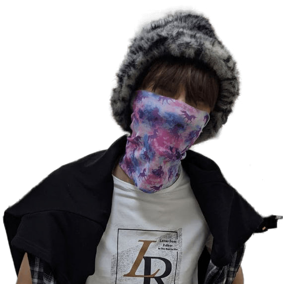

# Name and surname

**Vladislav Shabolda**

## Contacts for communication:

- Email: vladneckt@gmail.com
- My Number: +375-29-608-13-50
- Telegram Username: @superjunior2004

## Experience

I have experience working with js, html, css. <br>Below I have provided examples of my work

## Brief information about yourself:

- The purpose of life is to live and not need anything.<br>
  My strengths :
  - independence
  - stress resistance
  - assiduity
  - creativity
  - punctuality
  - industriousness 
  - increased performance

## Education:

- Belarusian-Russian University:<br>August 2022 - haven't graduated yet
- RS School<br>Spring 2023 - did not graduate

## Skills:

- Pascal ABC - 100/100
- C# - 80/100
- HTML - 75/100
- CSS - 70/100
- Git - 80/100
- JS - 15/100
- C++ - 20/100

## Code examples:

```js
const chai = require("chai");
const assert = chai.assert;
chai.config.truncateThreshold=0;
describe("Persistent Bugger.", () =>
{
it("Fixed tests", () => {
assert.strictEqual(persistence(39),3);
assert.strictEqual(persistence(4),0);
assert.strictEqual(persistence(25),2);
assert.strictEqual(persistence(999),4);
});
});
function persistence(num)
{
let counter = 0;
let digits = num.toString().split('');
while (digits.length > 1)
{
num = digits.reduce((a, b) => a * b);
digits = num.toString().split('');
counter++;
}
return counter;
}
```
## English language:
 
 - Elementary (A2)